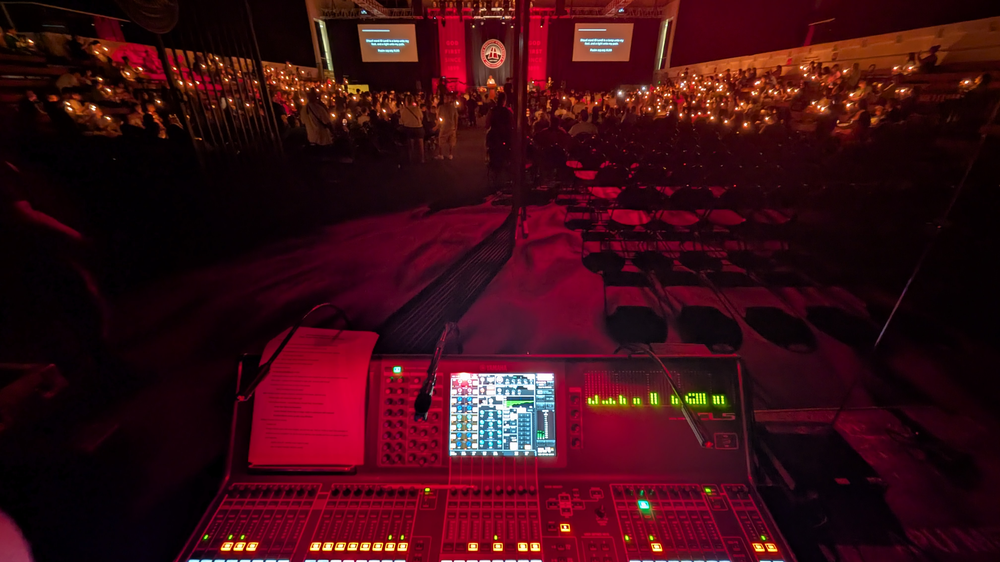

<h1 data-testid="page-title">Audio</h1>

Since 2024, I've been deep in the world of Live Production, specifically live audio. Starting as an A2, I quickly learned as much as I could about what's needed in the industry, and spent every possible minute I had working on and perfecting my craft.

  
  
  
  
  
  

